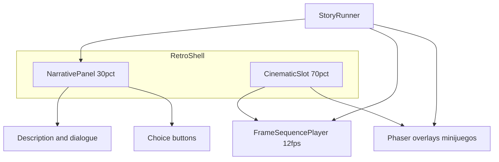

# Estructura y estética low-res (Phaser + TypeScript)

## Contexto

- Carpeta del repo: vacía → habrá que **bootstrap** completo (no hay archivos existentes que adaptar).
- Alcance acordado: **solo arquitectura + preparación estética**; diálogos reales, minijuegos y combate quedan como extensiones sobre interfaces ya definidas.

## Decisión clave: cinemática arriba (secuencia de imágenes, 12 fps)

Acordado contigo: **no depender de GIF**; usar **muchas imágenes** como animación a **12 fps** (periodo ~83 ms por frame).

- **Implementación en Phaser (recomendada)**: un `GameObjects.Image` en el área del 70% que en `update` o con un **timer** avanza `setTexture` entre keys precargadas (`scene_01_000`, `scene_01_001`, …) o un array de keys generado en `preload` con bucle `for` + `this.load.image`.
- **Contrato de datos** en el nodo de historia: algo como `cinematic: { kind: 'sequence', baseKey: 'intro_hall', frameCount: 24, fps: 12, loop: true | false, holdOnLastFrame: true }` (nombres finos al implementar). `fps` por defecto **12** pero configurable por clip. **Por defecto**, si `loop` es false, al terminar el clip **se congela en el último frame** hasta la siguiente acción del jugador (tu preferencia).
- **Preload**: registrar todas las texturas del clip activo (o por grupos) para evitar parpadeos; clips muy largos pueden particionarse después con “streaming” de carga (fuera del alcance inicial).
- **Opcional más adelante**: spritesheet/atlas si preferís pack en un solo archivo; **WebM** solo si algún clip pide muchísimos frames y pesa de más.

Abstracción sugerida: `**FrameSequencePlayer`** (o `CinematicLayer`) usado por `NarrativeScene`, desacoplado del `StoryRunner` para que los nodos solo declaren metadatos del clip.

## Stack y arranque

- **Vite + TypeScript** (rápido HMR, despliegue estático en cualquier hosting).
- **Phaser 3** como motor (escenas, futuros minijuegos/combate en escenas dedicadas).
- **Estructura de carpetas sugerida** (todo bajo `src/`):

| Ruta                                                | Rol                                                                                   |
| --------------------------------------------------- | ------------------------------------------------------------------------------------- |
| `src/main.ts`                                       | Bootstrap Vite, monta layout HTML + arranca Phaser                                    |
| `src/game/createGame.ts`                            | Config Phaser (`scale`, `parent`, `scene`, `pixelArt: true`)                          |
| `src/scenes/BootScene.ts` / `PreloadScene.ts`       | Carga mínima de placeholders                                                          |
| `src/scenes/NarrativeScene.ts`                      | Escena “hub” en el slot superior; controla `FrameSequencePlayer` + se comunica con UI |
| `src/cinematic/FrameSequencePlayer.ts` (o similar)  | Avanza frames a 12 fps, loop / detener en último frame según config del nodo          |
| `src/narrative/types.ts`                            | Tipos: `StoryNode`, `Choice`, condiciones sobre flags                                 |
| `src/narrative/FlagStore.ts`                        | `get/set/has`; serialización opcional `toJSON`/`fromJSON` (guardados después)         |
| `src/narrative/StoryRunner.ts` (stub)               | API mínima: `presentNode`, `choose`, `evaluateEnding` vacío o con 1 ejemplo           |
| `src/narrative/script/`                             | Carpeta vacía o `sample.nodes.ts` con 2–3 nodos de prueba                             |
| `src/ui/narrative-panel.css` + `narrative-panel.ts` | Panel inferior 30%: título, texto, botones de opción                                  |
| `src/ui/RetroShell.css`                             | Marco global: CRT/scanlines opcional, cursor, fuente monoespaciada                    |
| `public/assets/`                                    | Placeholder pixel art o color sólido                                                  |

## Layout 70 / 30

- Contenedor raíz en `index.html`: **flex column**, `height: 100dvh`.
- **70%**: contenedor `#cinematic` con **canvas Phaser** (secuencia de frames en la parte superior del mundo o cámara recortada a ese rectángulo).
- **30%**: `#narrative-ui` fijo abajo con scroll interno si el texto crece.
- Phaser `Scale.FIT` o tamaño fijo interno (ej. **base width 320–640px**, height proporcional al slot 70%) y **CSS** `image-rendering: pixelated` + `crisp-edges` en el canvas para look FAITH-like.

## Estética low-res (sin assets finales todavía)

- **Resolución lógica baja** escalada ×2–×4 en pantallas modernas.
- **Paleta**: documentar en comentario o constante `PALETTE` (ej. 1-bit / 4 colores) para alinear futuros assets con dithering.
- **Post-proceso ligero en CSS** (no obligatorio en código inicial): overlay scanlines con `repeating-linear-gradient`, leve vignette, opcional animación de “noise” muy sutil (performance: `will-change` con cuidado).
- **Tipografía**: una fuente pixel (ej. **Silkscreen**, **Press Start 2P**, o similar libre) vía Google Fonts o archivo local en `public/fonts/`.

## Contratos para lo que vendrá después

Definir tipos TypeScript **estables** para que cuando mandes historia solo rellenes datos:

- **Flags**: `Record<string, boolean | number | string>` con helpers `increment`, `toggle`.
- **Nodos**: `id`, `cinematic?` (`{ kind: 'sequence', baseKey, frameCount, fps?: number (default 12), loop?, holdOnLastFrame? }` o `kind: 'still', key }` para una sola imagen), `lines[]`, `choices[]`, `onEnter`/`onLeave` opcionales (callbacks o ids de evento).
- **Condiciones**: función o mini-DSL (`{ flag: 'x', gte: 3 }`) evaluada en `StoryRunner`.
- **Finales**: función `computeEnding(flags): string` stub que devuelve `'UNKNOWN'` hasta que definas reglas.

Minijuegos/combate: registrar escenas Phaser por nombre (`registry` o mapa `minigames: Record<string, typeof Scene>`) y desde un nodo `type: 'minigame', sceneKey: 'Combat1'`.

## Verificación manual (post-implementación, fuera de este plan)

- `npm run dev`: layout 70/30 estable al redimensionar.
- Cambiar tamaño ventana: escala pixelada sin blur.
- Flujo demo: 2 elecciones que setean un flag y muestran texto distinto.

## Archivos que se crearán (resumen)

- `package.json`, `vite.config.ts`, `tsconfig.json`, `index.html`
- `src/main.ts`, `src/game/createGame.ts`, escenas bajo `src/scenes/`
- `src/narrative/`*, `src/ui/`*, estilos globales
- `.gitignore`, `README.md` mínimo con cómo correr el dev server (si quieres evitar README, se puede omitir salvo que lo pidas)

No se añaden aún: PWA, i18n, guardado en `localStorage`, ni librerías de diálogo pesadas — solo ganchos en `FlagStore`/`StoryRunner`.
